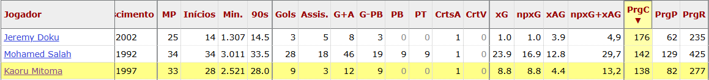
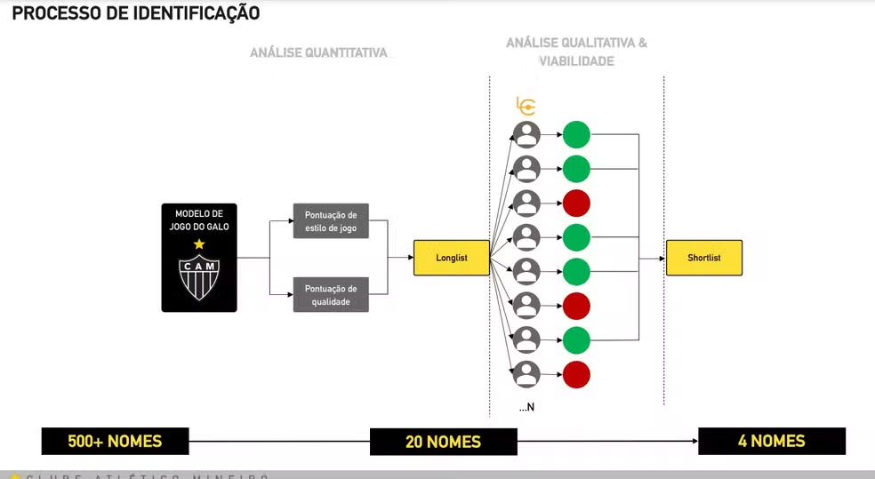
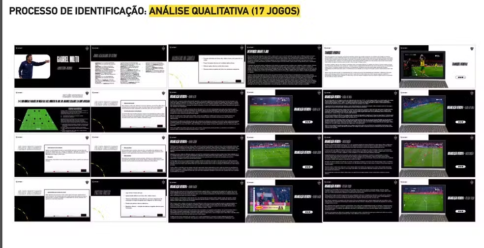

# **A Revolução dos Dados na Contratação de Atletas no Futebol**

### **Introdução**

O futebol, por décadas, foi movido quase exclusivamente pela intuição, experiência e subjetividade. Técnicos, diretores e olheiros tomavam decisões com base em impressões, vídeos isolados ou indicações de empresários — muitas vezes sem qualquer embasamento técnico ou estatístico. No entanto, esse cenário começou a mudar com o avanço da tecnologia e da análise de dados. Clubes ao redor do mundo perceberam que, assim como em outros setores da economia, a informação precisa e o uso inteligente de dados poderiam oferecer vantagem competitiva também dentro das quatro linhas. Neste contexto, a contratação de jogadores passou a incorporar ferramentas analíticas sofisticadas, cruzando métricas de desempenho, modelos preditivos e variáveis financeiras. Este trabalho busca mostrar como clubes como Brentford, Brighton, Liverpool, Atlético-MG e Botafogo estão revolucionando suas estratégias de recrutamento por meio de dados — e como essa transformação tem impacto direto nos resultados esportivos e financeiros.

---

### 1. Contratações Ontem e Hoje: Do Achismo ao Algoritmo

As decisões ficavam, em grande parte, nas mãos do diretor de futebol e do técnico, que se baseiam em experiências pessoais passadas — como já ter enfrentado o jogador, ter visto algum vídeo, ou até por conta da influência de empresários que faziam lobby junto à diretoria. Essas análises, muitas vezes subjetivas e sem critérios técnicos claros, podiam facilmente ser enviesadas, beneficiando apenas um dos lados da negociação. Em resumo, era um processo com pouca transparência e sem embasamento analítico confiável. Hoje, graças a quantidade de empresas que geram dados como, [Hudl StatsBomb](https://statsbomb.com/pt-pt/), [OptaAnalyst](https://theanalyst.com/), [FBRef](https://fbref.com/pt/) e [SofaScore](https://www.sofascore.com/pt/), os clubes podem ter uma analise de dados muito completa usando esses dados.

---

### 2. Uso de Dados na Maior Liga do Mundo, Premier League.

* Segundo o artigo "*[Como os departamentos de dados evoluíram e se espalharam pelos clubes de futebol inglês](https://www.nytimes.com/athletic/5697684/2024/09/03/football-analytics-uk-evolution/)*", o uso de dados se tornou parte essencial da maneira como clubes analisam e veem o jogo. A chamada "revolução Moneyball" se espalhou pelo futebol europeu, com clubes como Brentford, Brighton e Liverpool liderando essa transformação. Hoje, analisar estatísticas avançadas é tão importante quanto observar habilidades técnicas no campo.  
* Matthew Benham, proprietário do Brentford FC, foi um dos pioneiros dessa mudança. Fundador da empresa de análise estatística Smartodds, Benham apostou no uso de algoritmos, dados de performance e modelos preditivos para encontrar jogadores que se encaixassem no estilo de jogo do Brentford — muitas vezes contratando atletas subvalorizados por outros clubes.  
* O Brentford, por exemplo, não apenas utilizou dados para identificar talentos, mas construiu toda sua política de contratações baseada em métricas como "xG" (gols esperados), passes progressivos e contribuições táticas. Essa abordagem orientada por dados foi essencial para que o clube conquistasse o acesso à Premier League e se mantivesse competitivo, mesmo com orçamento inferior aos gigantes do campeonato.  
* Ainda assim, o artigo destaca que o sucesso nesse novo modelo não é garantido apenas pela coleta de dados: é preciso saber interpretar, comunicar e integrar essas informações no processo de decisão do clube. Os clubes que conseguem alinhar analistas, treinadores e diretores esportivos em torno da análise de dados são os que conseguem colher melhores resultados — como é o caso do Brentford.  
* Portanto, a evolução dos departamentos de dados no futebol inglês mostra que, no cenário atual, **dados e intuição não são concorrentes, mas aliados**. O futebol moderno exige cada vez mais decisões embasadas, e os clubes que souberem usar bem essa ferramenta terão vantagem dentro e fora de campo.

 Fonte: <a href=https://www.nytimes.com/athletic/5697684/2024/09/03/football-analytics-uk-evolution/.>How data departments have evolved and spread across English football clubs.</a>

**Dado de impacto:**

- Moisés Caicedo contratado pelo Brighton por 6 milhões de Euros do Independiente Del Valle e vendido por 115 milhões de Libras junto ao Chelsea.

Dados de Moisés Caicedo nas 2 últimas temporadas pelo Brighton, foco maior para a PrgP (Passes progressivos, passes que avançam mais de 8 metros em direção ao gol, exclui 40% do campo defensivo) e para taxa de passes concluídos a cima de 90% em passes curtos e médios na ultima temporada no clube inglês.

 Fonte: <a href=https://fbref.com/pt/.>https://fbref.com/pt/.</a>

Transferências e Contratações Marcantes:  

* Brentford  
    * Ollie Watkins foi contratado do Exeter por £7.2 milhões e depois vendido ao Aston Villa por £34 milhões.  
    * Neal Maupay foi comprado por £2 milhões e vendido por £22.2 milhões.  
    * Ezri Konsa foi contratado do Charlton por £2.85 milhões e depois comprado pelo Aston Villa por £13.3 milhões.  
    * Eles também tiveram um lucro de £21.4 milhões com Said Benrahma.
* Brighton  
    * ​O Brighton contratou Kaoru Mitoma por cerca de €3 milhões em agosto de 2021, vindo do Kawasaki Frontale, do Japão. O clube inglês recebeu uma proposta de 54 Milhões de Libras do Al-Nassr, clube saudita onde joga Cristiano Ronaldo.

Dados de Kaoru Mitoma na atual temporada, terceiro jogador com maior quantidade de corridas progressivas, com media de 4,18 carregadas por jogo, isso significa que ele percorreu mais de 4 vezes por jogo a distância de 9 metros com a bola no pé.

* Liverpool  - Arne Slot:
      - Quase uma década depois, a coleta de dados do Liverpool se aprofunda ainda mais.  Spearman, um físico nascido em Chicago e formado em Harvard, que passou cinco anos como cientista-chefe de dados do Liverpool antes de suceder Graham como diretor de pesquisa do clube em janeiro do ano passado, vem trabalhando em um algoritmo que avalia o desempenho dos treinadores com base em uma ampla gama de métricas — não apenas o desempenho da equipe, mas também o estilo de jogo, o desenvolvimento individual dos jogadores, a compatibilidade com diferentes tipos de jogadores etc. — para prever resultados futuros e a adequação para determinadas funções.
      - Os resultados de Slot, refletindo seu desempenho durante três temporadas no comando do Feyenoord, são considerados impressionantes: "O topo dos topos".  Hughes e Edwards já haviam mencionado Slot, entre outros, como um forte candidato. Mas não esperavam que os dados trouxessem um apoio tão contundente à sua candidatura.
      - Edwards e Hughes acreditam que o estilo de jogo ofensivo de Slot, emocionante, intenso, de alta pressão e baseado na posse de bola, preencheu os requisitos para energizar os jogadores e a torcida do Liverpool. Dada a confiança no talento que já existe no clube, eles estão convencidos de que seu estilo será adequado para o elenco que ele herdará. 
      - Resultado disso tudo? Liverpool campeão na temporada de estreia do técnico Holandes, se tornando apenas o 5 a conquistar o título na temporada de estreia da Premier League e, o clube arrecadou até £180 milhões em premiações da liga, valor que inclui os maiores pagamentos por mérito (por terminar em primeiro lugar), taxas de instalação (por ter sido televisionado 29 vezes no Reino Unido) e outras parcelas relacionadas aos direitos de transmissão. Além disso, a conquista gerou um bônus adicional de £2 milhões da Nike, patrocinadora de material esportivo à época, e impulsionou um crescimento ainda maior nas receitas comerciais e de jogos.
      
      
 Fonte: <a href=https://www.nytimes.com/athletic/6315318/2025/05/01/how-much-liverpool-earned-by-winning-the-premier-league/.>How much Liverpool earned by winning the Premier League - The Athletic .</a>

 Fonte: <a href=https://www.nytimes.com/athletic/5441110/2024/05/20/liverpool-arne-slot-manager-inside-story/.>How Liverpool hired Arne Slot: The data, surprise contenders and why talks grew tense \- The Athletic.</a>

**Quanto um clube pode ganhar, além das transferências, por contar com um departamento de dados bem estruturado e integrado?**  

  * A resposta está nos números: clubes que transformam dados em decisões impactam diretamente seu desempenho técnico e financeiro. Na temporada 2023/24 da Premier League, isso ficou evidente.  
  * Para efeito de comparação, os dois clubes de baixa renda analisados neste estudo, Brentford e o Brighton, geraram receitas expressivas apenas com a participação na liga.

* O **Brighton** e o **Brentford**, mesmo com estruturas menores, faturaram **£131,5 milhões** e **£124,3 milhões**, respectivamente — valores que demonstram como uma gestão eficiente e orientada por dados pode otimizar os ganhos, mesmo sem os maiores orçamentos da liga.  
* Esses números reforçam que **ter um departamento de dados bem integrado não é luxo, é investimento estratégico** — que gera valor dentro de campo, na tabela, e no caixa do clube.

---

### 3. A Realidade Brasileira: Atlético-MG e Botafogo

#### 3.1. Atlético-MG: CIGA como Referência

O Atlético foi pioneiro no Brasil ao ter um departamento exclusivo para Análise de Dados. O CIGA funciona como um departamento de informação que subsidia o departamento de futebol. Seu principal propósito é embasar as decisões do clube nas questões ligadas ao futebol, utilizando ferramentas de análise. É fundamental destacar que o CIGA não toma as decisões finais de contratação ou venda, apenas oferece o suporte informacional para que os tomadores de decisão (como o comitê de futebol e a diretoria) possam agir com confiança. Os critérios de avaliação incluem:

- Rendimento atual vs. projeção futura
- Comportamento tático específico
- Capacidade técnica
- Adaptação ao modelo de jogo do clube

Após essa triagem, os atletas passam por um processo que envolve observação in loco, verificação de histórico de lesões, análise de contexto e viabilidade financeira. Um diferencial do CIGA é o "background check", que avalia aspectos extracampo dos jogadores, garantindo uma contratação alinhada aos valores e necessidades do clube.

#### 3.2. Botafogo: Parcerias Estratégicas para Potencializar a Análise de Dados

O Botafogo tem investido significativamente na modernização de seu departamento de análise de desempenho e scout. Em 2023, o clube firmou uma parceria com a [Driblab](https://www.driblab.com/), empresa especializada em consultoria e análise de dados, visando aprimorar a prospecção de talentos e a análise de mercado. Essa colaboração proporciona ao Botafogo acesso a uma vasta gama de estatísticas e métricas avançadas, além de soluções baseadas nas mais modernas metodologias de rastreamento e monitoramento de jogadores na indústria .

 Fonte: <a href=https://www.botafogo.com.br/noticias/parceria-de-excel-ncia.>Botafogo e Driblab firmam acordo que vai potencializar gestão de dados, estatísticas e métricas na área de Análise de Mercado</a>

Em 2024, o clube deu um passo adicional ao estabelecer uma parceria com a [SkillCorner](https://skillcorner.com/), líder em rastreamento e análise de atletas por meio de tecnologias alimentadas por Inteligência Artificial. Essa colaboração visa fornecer dados físicos precisos e completos em larga escala, ampliando o leque de observação de jogadores em todo o mundo e, principalmente, seus aspectos físicos. O Botafogo agora integra a cartela de mais de 160 clubes e federações assistidas pela empresa .

 Fonte: <a href=https://www.botafogo.com.br/noticias/monitoramento-ampliado.>Botafogo e SkillCorner iniciam parceria de rastreamento de dados em escala global</a>

Essas parcerias refletem o compromisso do Botafogo em utilizar tecnologia de ponta para fortalecer sua estrutura de análise de desempenho, alinhando-se às melhores práticas internacionais e buscando excelência tanto dentro quanto fora de campo.

---

### 4. Exemplos Concretos no Brasil

#### **4.1. Brahian Palacios (Atlético-MG)**

* Perfil buscado: extremo de velocidade, jovem, com potencial de revenda.
* Processo: dados → shortlist → avaliação in loco → contratação.
* Fala do clube sobre o projeto de desenvolvimento do atleta.
    * `"Ele tinha as características buscadas naquele momento. Trouxemos com o intuito de terminar de desenvolver, dar o tempo para adaptação. Assim que ele começar a performar, acreditamos que ele possa ser um jogador a ser utilizado no mercado." Rodrigo Weber`

 Fonte: <a href=https://ge.globo.com/futebol/times/atletico-mg/noticia/2024/11/30/criado-por-diretor-do-botafogo-centro-de-analise-do-atletico-mg-auxiliou-na-contratacao-de-milito-e-reforcos-conheca.ghtml.>https://ge.globo.com/futebol/times/atletico-mg/noticia/2024/11/30/criado-por-diretor-do-botafogo-centro-de-analise-do-atletico-mg-auxiliou-na-contratacao-de-milito-e-reforcos-conheca.ghtml.</a>

#### **4.2. Lyanco (Atlético-MG)**

A contratação de Lyanco pelo Atlético-MG é um exemplo de como o CIGA tem sido essencial para identificar o perfil ideal de jogador. O clube superou a concorrência do Botafogo, que ofereceu uma proposta financeira melhor, usando dados detalhados para justificar a escolha.

O CIGA analisou o desempenho atual de Lyanco, sua adaptação ao estilo de jogo do Galo e seu comportamento tático. A equipe utilizou 12 softwares e analisou mais de 50 mil atletas em 38 ligas diferentes. Lyanco se encaixava nas métricas do clube, que prioriza agressividade e controle tanto com a bola quanto sem ela.

Além dos dados, a reunião de apresentação do "projeto Galo", onde Lyanco foi mostrado com a camisa do clube, foi um momento chave. Como comentou Rodrigo Weber, ao ver a imagem com a camisa, Lyanco se empolgou, decidindo que precisava viver essa experiência. Esse processo, aliado à análise do "background check" do jogador, foi crucial para garantir sua contratação.

 Fonte: <a href=https://ge.globo.com/futebol/times/atletico-mg/noticia/2025/03/20/contratacao-de-lyanco-pelo-atletico-mg-foi-indicacao-do-ciga-entenda-processos-do-departamento.ghtml.>https://ge.globo.com/futebol/times/atletico-mg/noticia/2025/03/20/contratacao-de-lyanco-pelo-atletico-mg-foi-indicacao-do-ciga-entenda-processos-do-departamento.ghtml.</a>

---

### 5. Mais do que Estatísticas: A Complexidade por Trás dos Números

- O uso de dados no futebol vai além da análise de jogadores. A contratação do técnico Gabriel Milito, por exemplo, passou também pelo crivo do CIGA. O Atlético-MG preparou uma apresentação para a reunião com o treinador, na qual o clube detalha como chegou ao nome do treinador. O processo para selecionar o treinador começou com uma análise de mais de 500 treinadores. Essa lista foi então reduzida para 20 nomes, chegando posteriormente aos quatro escolhidos.
- Durante esse processo, foram apresentados dados qualitativos e quantitativos dos treinadores avaliados. O Ciga (Centro de Informação do Galo) realizou uma análise de dados para verificar o quanto Milito se encaixaria no estilo de jogo do clube. No total, 17 partidas do treinador foram analisadas. Além da análise de dados e jogos, o clube também observou as entrevistas de Gabriel Milito, avaliando sua forma de se comunicar nas coletivas, bem como o comportamento do argentino.

- Em 2024, o clube mineiro alcançou a final da Libertadores e da Copa do Brasil, encerrando a temporada como vice-campeão nas duas competições. Sob o comando de Gabriel Milito, a equipe demonstrou consistência e evolução, garantindo R$ 92,8 milhões em premiação no torneio continental e mais R$ 51,14 milhões na Copa do Brasil. Ao todo, o Galo arrecadou R$ 143,94 milhões apenas com essas campanhas, consolidando o impacto positivo do trabalho do treinador argentino.
- Outro ponto importante é o equilíbrio do elenco: o Atlético-MG busca manter uma base de atletas experientes enquanto desenvolve jovens com potencial de mercado. Essa estratégia é monitorada continuamente pelo departamento de inteligência.
- Além do desempenho em campo, o background check é uma etapa essencial: o clube investiga a vida pessoal e profissional dos atletas, avaliando histórico de lesões, comportamento extra-campo e perfil psicológico — um trabalho que demonstra a profundidade do processo.

 Fonte: <a href=https://ge.globo.com/futebol/times/atletico-mg/noticia/2024/03/24/exclusivo-apresentacao-do-atletico-mg-a-gabriel-milito-tem-robert-no-elenco-e-possiveis-saidas-veja.ghtml.>https://ge.globo.com/futebol/times/atletico-mg/noticia/2024/03/24/exclusivo-apresentacao-do-atletico-mg-a-gabriel-milito-tem-robert-no-elenco-e-possiveis-saidas-veja.ghtml.</a>

---

### 6. Perspectivas Futuras: Para Onde Caminha o Futebol com Dados?

- Crescimento de departamentos de análise em clubes brasileiros (Botafogo, Red Bull Bragantino, São Paulo).

    - O uso de dados no futebol ainda enfrenta certa resistência, especialmente entre os clubes brasileiros. Muitos times ainda não contam com um departamento especializado em análise e tratamento de dados, priorizando contratações — muitas vezes feitas no escuro — em vez de investir em inteligência esportiva.

    - Apesar disso, o cenário tem sinais promissores de mudança. Clubes como Red Bull Bragantino, Botafogo, Atlético-MG, Palmeiras e Flamengo já adotam práticas mais consistentes no uso de dados para embasar decisões. Ainda assim, o nível de maturidade está distante do que se observa na Premier League, referência nesse campo.

    - A tendência, porém, é de evolução. Com o avanço das discussões sobre uma liga nacional e o crescimento expressivo das SAFs no Brasil, o tema tende a se popularizar. Resta ver como os clubes irão se adaptar para estruturar departamentos de dados sólidos, capazes de transformar informação em vantagem competitiva.

- No entanto, esse crescimento levanta questões importantes: quem deve controlar os dados dos atletas? Os clubes que os coletam? As empresas que os processam? Ou os próprios jogadores? A discussão sobre privacidade e uso ético das informações já começa a surgir nos bastidores do futebol.

- À medida que a tecnologia avança, o desafio será equilibrar desempenho, transparência e direitos individuais — mantendo o futebol competitivo, mas também justo.

---

### **Conclusão**

A análise de dados transformou o futebol, substituindo decisões baseadas em intuições e achismos por escolhas informadas e objetivas. Clubes como Brentford, Brighton, Liverpool e Atlético-MG demonstram como o uso inteligente de estatísticas avançadas e modelos preditivos pode gerar sucesso esportivo e ganhos financeiros expressivos. O exemplo de Brighton, que comprou Moisés Caicedo por um valor baixo e o vendeu por uma quantia alta, ilustra o impacto positivo dessa abordagem.
No Brasil, o Atlético-MG, com seu Centro de Inteligência e Gestão (CIGA), exemplifica como a análise de dados pode aprimorar o processo de recrutamento e tornar os clubes mais competitivos. O uso de dados, aliado à intuição dos profissionais, tem se mostrado uma estratégia poderosa e necessária para alcançar não apenas resultados no campo, mas também sustentabilidade financeira.
Com a crescente adoção de tecnologias analíticas, o futebol do futuro será ainda mais orientado por dados, consolidando a ideia de que no futebol moderno, **quem entende de números, joga com 12 em campo.**

## Bibliografia

> **THE ATHLETIC.** How Liverpool hired Arne Slot: The data, surprise contenders and why talks grew tense. *The Athletic*, 2024. Disponível em: [https://www.nytimes.com/athletic/5441110/2024/05/20/liverpool-arne-slot-manager-inside-story/](https://www.nytimes.com/athletic/5441110/2024/05/20/liverpool-arne-slot-manager-inside-story/). Acesso em: 30 abr. 2025.

> 
> **BUCKINGHAM, Philip.** How much Liverpool earned by winning the Premier League. *The Athletic*, 2025. Disponível em: [https://www.nytimes.com/athletic/6315318/2025/05/01/how-much-liverpool-earned-by-winning-the-premier-league/](https://www.nytimes.com/athletic/6315318/2025/05/01/how-much-liverpool-earned-by-winning-the-premier-league/). Acesso em: 30 abr. 2025.

> 
> **FBREF.** FBRef - Estatísticas de futebol. *FBRef*, [s.d.]. Disponível em: [https://fbref.com/pt/](https://fbref.com/pt/). Acesso em: 30 abr. 2025.

> 
> **GE GLOBO.** Criado por diretor do Botafogo, Centro de Análise do Atlético-MG auxiliou na contratação de Milito e reforços. *GE*, 2024. Disponível em: [https://ge.globo.com/futebol/times/atletico-mg/noticia/2024/11/30/criado-por-diretor-do-botafogo-centro-de-analise-do-atletico-mg-auxiliou-na-contratacao-de-milito-e-reforcos-conheca.ghtml](https://ge.globo.com/futebol/times/atletico-mg/noticia/2024/11/30/criado-por-diretor-do-botafogo-centro-de-analise-do-atletico-mg-auxiliou-na-contratacao-de-milito-e-reforcos-conheca.ghtml). Acesso em: 30 abr. 2025.

> 
> **YOUTUBE.** How Brentford's Moneyball Approach Works. *YouTube*, 2024. Disponível em: [https://www.youtube.com/watch?v=mrwwVoD1RQQ](https://www.youtube.com/watch?v=mrwwVoD1RQQ). Acesso em: 30 abr. 2025.

> 
> **THE ATHLETIC.** How data departments have evolved and spread across English football clubs. *The Athletic*, 2024. Disponível em: [https://www.nytimes.com/athletic/5697684/2024/09/03/football-analytics-uk-evolution/](https://www.nytimes.com/athletic/5697684/2024/09/03/football-analytics-uk-evolution/). Acesso em: 30 abr. 2025.

> 
> **BOTAFOGO DE FUTEBOL E REGATAS.** Monitoramento ampliado: Botafogo fecha parceria com a SkillCorner. Botafogo.com.br, 26 abr. 2024. Disponível em: [https://www.botafogo.com.br/noticias/monitoramento-ampliado](https://www.botafogo.com.br/noticias/monitoramento-ampliado). Acesso em: 30 abr. 2025.
>
> **BOTAFOGO DE FUTEBOL E REGATAS.** Parceria de excelência: Botafogo firma acordo com a Driblab. Botafogo.com.br, 2 mar. 2023. Disponível em: [https://www.botafogo.com.br/noticias/parceria-de-excel-ncia](https://www.botafogo.com.br/noticias/parceria-de-excel-ncia). Acesso em: 30 abr. 2025.
>
> **FONSECA, Guilherme.** Contratação de Lyanco pelo Atlético-MG foi indicação do Ciga; entenda processos do departamento. GE.globo.com, 20 mar. 2025. Disponível em: [https://ge.globo.com/futebol/times/atletico-mg/noticia/2025/03/20/contratacao-de-lyanco-pelo-atletico-mg-foi-indicacao-do-ciga-entenda-processos-do-departamento.ghtml](https://ge.globo.com/futebol/times/atletico-mg/noticia/2025/03/20/contratacao-de-lyanco-pelo-atletico-mg-foi-indicacao-do-ciga-entenda-processos-do-departamento.ghtml). Acesso em: 30 abr. 2025.
>
> **VALE, Gabriel.** Exclusivo: apresentação do Atlético-MG a Gabriel Milito tem Robert no elenco e possíveis saídas; veja. GE.globo.com, 24 mar. 2024. Disponível em: [https://ge.globo.com/futebol/times/atletico-mg/noticia/2024/03/24/exclusivo-apresentacao-do-atletico-mg-a-gabriel-milito-tem-robert-no-elenco-e-possiveis-saidas-veja.ghtml](https://ge.globo.com/futebol/times/atletico-mg/noticia/2024/03/24/exclusivo-apresentacao-do-atletico-mg-a-gabriel-milito-tem-robert-no-elenco-e-possiveis-saidas-veja.ghtml). Acesso em: 30 abr. 2025.
>
> CAREY, Mark. How data departments have evolved and spread across English football clubs. The Athletic, 3 set. 2024. Disponível em: [https://www.nytimes.com/athletic/5697684/2024/09/03/football-analytics-uk-evolution/](https://www.nytimes.com/athletic/5697684/2024/09/03/football-analytics-uk-evolution/). Acesso em: 30 abr. 2025.​

[Link para o documento de organização](https://docs.google.com/document/d/1Kbm_D0azWeWWit153eQ_fyVsM7tAsjoh0MA0pvCZrO0/edit?usp=sharing)
