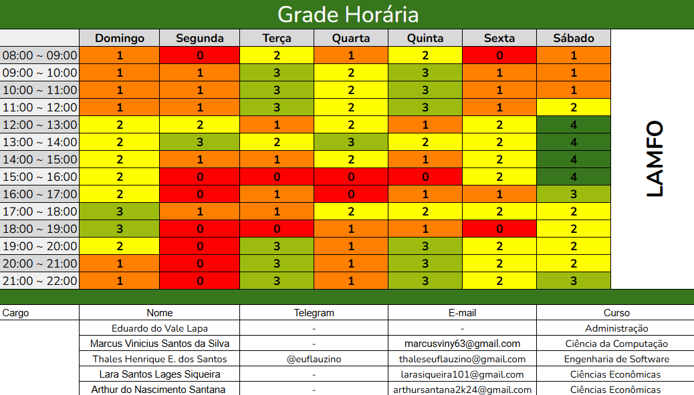

---
hide:
  - toc
---

## Introdução

Para garantir a entrega das pesquisas referentes à oficina, é essencial a realização de uma reunião para o planejamento e gravação do material. Com o intuito de organizar e agilizar o agendamento dos encontros, foi elaborado um heatmap que apresenta a disponibilidade dos membros da equipe.

Na **Figura 1**, as células com o valor "0" indicam a ausência de disponibilidade, enquanto aquelas com o valor "4" apontam os horários com maior potencial de participação para a reunião.

##### 
 **Figura 1:** Heatmap de Disponibilidade do G4

  
<b>Autor:</b> <a href="https://www.github.com/thaleseuflauzino">Thales Euflauzino</a>, 2025

## Resultados

A análise do heatmap, preenchido pelos membros do grupo, resultou na reserva dos seguintes períodos para a reunião:

- **Sábado:** das 12:00 às 16:00
- **Terça-feira:** das 09:00 às 12:00 e das 19:00 às 22:00
- **Quinta-feira:** das 09:00 às 12:00 e das 19:00 às 22:00

Como não houve nenhum horário em que todos pudessem estar disponíveis ao mesmo tempo, decidimos fazer a reunião, e os ausentes podem conferir a reunião na aba de [Atas](../atas/modelo).

## Histórico de Versões

| Versão | Data | Descrição | Autor(es) |
| ------ | ---- | --------- | --------- |
|`1.0`|23/04/2025| Adicionando heatmap | [Thales Euflauzino](https://github.com/thaleseuflauzino) |
